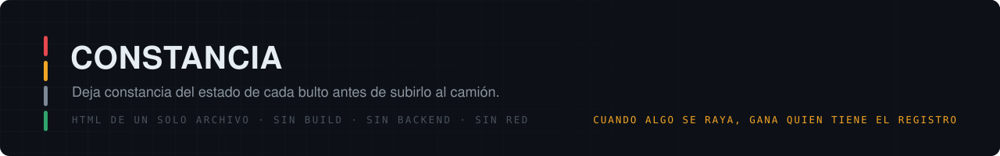
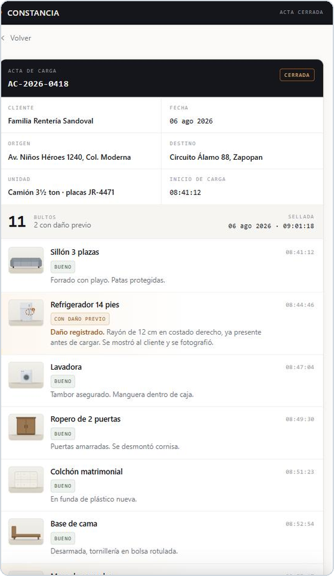

  
  
  
  

**Cuando algo se raya, gana quien tiene el registro.**

Maqueta de venta para una empresa de mudanzas. Un solo archivo, `index.html`, sin build,
sin backend, sin dependencias. Se abre desde un link en el celular y carga al instante —
que es exactamente como se enseña en la banqueta, antes de que arranque el camión.

  

---

## Los dos flujos

| | |
|---|---|
| **Acta de carga** | Deja constancia del estado de cada bulto **antes** de subirlo, con nota y sello de hora. Es el flujo principal: sin acta, cualquier reclamo posterior es palabra contra palabra. |
| **Cotización** | Levanta el inventario con foto, volumen y notas de acceso. No calcula ni muestra precio — el campo *"Su cotización"* va en blanco a propósito. |

Cada flujo tiene **un ejemplo terminado** (se ve completo) y **un flujo de armado** que se
detiene en el corte. La diferencia entre los dos es el argumento de venta.

## El sello de hora es el punto

Los documentos ya terminados llevan fecha congelada: son registros de una mudanza que ya
pasó, así que no se mueven nunca. Lo que el usuario arma en el momento se sella con el
**reloj real del teléfono**, corriendo segundo a segundo.

La razón es la que hace creíble a todo el resto: un "sello activo" que no coincide con el
reloj del propio celular no prueba nada.

## Reglas que el archivo respeta

- **Marca neutra.** No aparece el nombre ni el logo de ningún cliente real.
- **Ningún precio en pesos**, en ningún lado.
- El corte cierra con mensaje y firma. Sin botón, sin link, sin llamada a la acción.
- Recargar deja todo limpio: no hay persistencia.
- **Cero llamadas de red.** Funciona sin internet una vez cargado.

## Qué se toca al mantenerlo

| Símbolo | Qué controla |
|---|---|
| `DEMO_NOW` | Fecha y hora congeladas de los documentos ya terminados. |
| `ITEMS` | Catálogo de 15 piezas: nombre, volumen, dibujo y `mark` (dónde cae la marca de daño). |
| `ACTA` / `COT` | Datos semilla de los dos ejemplos terminados, escritos a mano. |
| `CUT` | Pasos de la transición del corte. El texto del mensaje y la firma están en `#cut-msg`, literales. |

Las 15 piezas son ilustraciones vectoriales dibujadas en el mismo encuadre y con la misma
luz, embebidas en el archivo. Sustituirlas por fotografías reales es un cambio local: cada
entrada de `ITEMS` toma su dibujo de `G`, y el envoltorio `shot()` ya aplica el encuadre y
el recorte de miniatura.

## Publicar

GitHub Pages sirviendo la raíz de la rama. `index.html` está en la raíz, así que no hace
falta configuración adicional.

---

*Demo de trabajo. Los datos que se ven — folios, nombres, domicilios, fechas — son de
muestra. Ningún cliente real aparece en este repositorio.*
